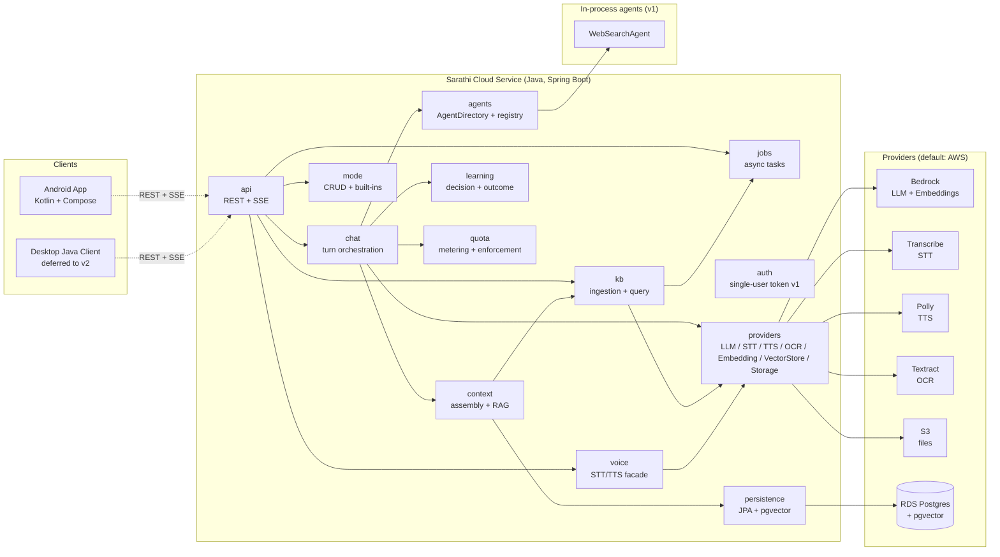
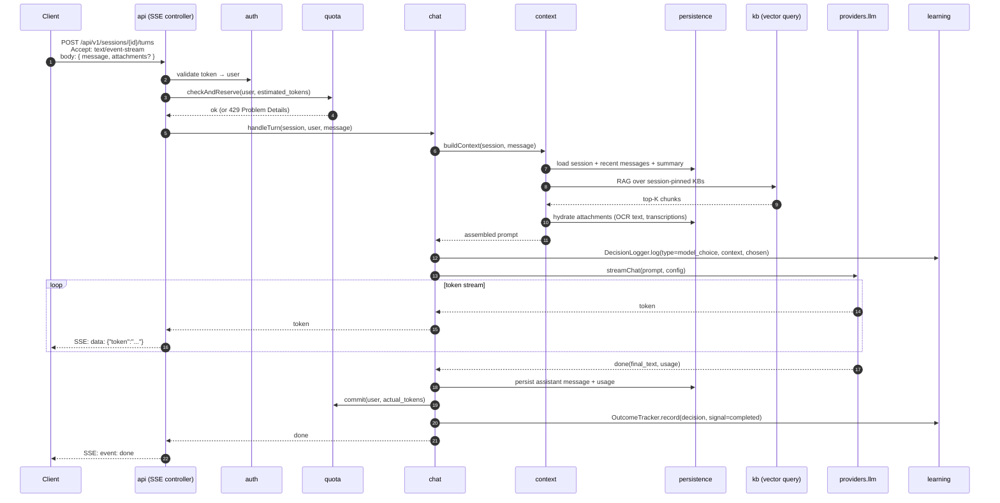
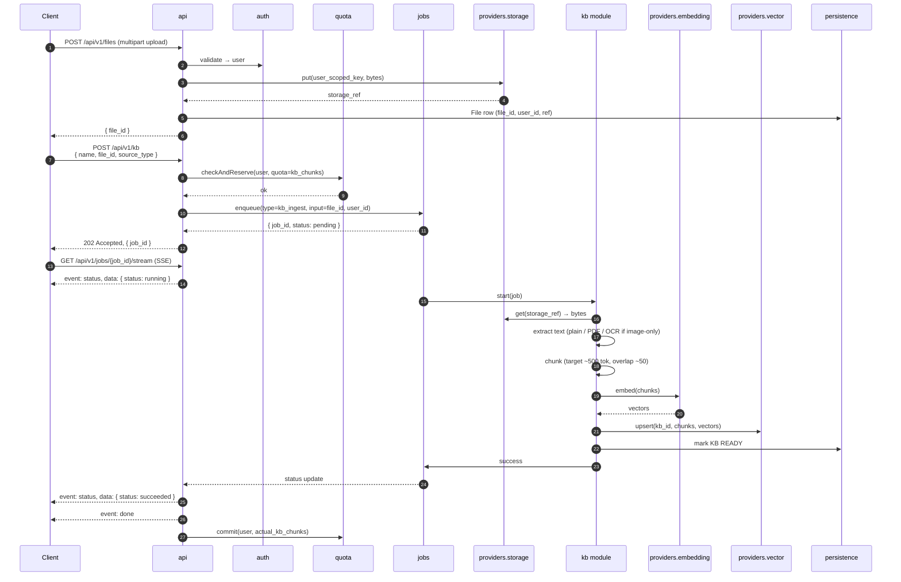
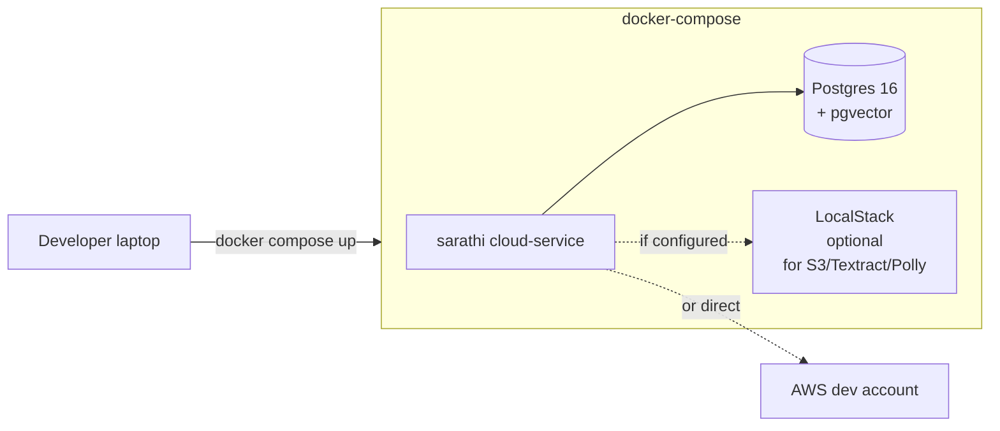
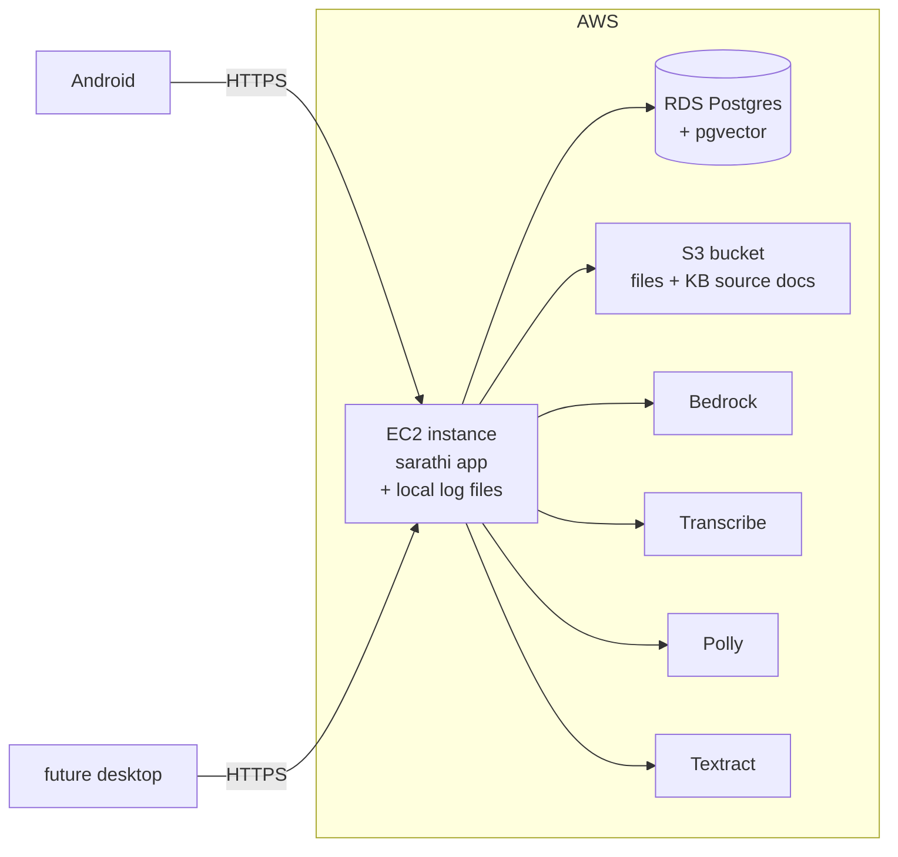

# Overall Architecture

> How Sarathi is put together. The *what* and *how* that serves the *why* in [`00-vision-and-principles.md`](00-vision-and-principles.md).

---

## 1. System at a glance

Sarathi is composed of three layers: **clients**, a **stateful backend (cloud service)**, and **providers** (abstractions over external capabilities with swappable implementations). Clients are thin. The backend is the brain. Providers are interchangeable.



Three properties to notice in this diagram:

1. **Clients never touch providers directly** (for via-backend voice, LLM, or storage). They only speak to `api`. Voice has a client-configured option to bypass the backend — see §5.3.
2. **Every external dependency is behind `providers`.** Swapping AWS Bedrock for Anthropic direct, or AWS Polly for ElevenLabs, is a configuration change — not a code change.
3. **`agents` is a seam, not a component tree.** In v1 it resolves to in-process Java classes. In v2 it resolves to a remote Discovery Service. Sarathi's code doesn't care which.

---

## 2. Component decomposition (names and responsibilities)

Thirteen modules inside the cloud service. Each has a sharp responsibility; responsibilities do not overlap.

| Module | Responsibility |
|---|---|
| `api` | REST controllers for CRUD; `api.streaming` for SSE (chat tokens, job status); `/api/v1/...` versioning; request validation; `@ControllerAdvice` with RFC 7807 Problem Details responses. |
| `chat` | Orchestrates a chat turn. Receives user message, consults `quota`, delegates context build to `context`, calls `providers.llm`, streams tokens back via `api.streaming`, persists the final message, logs decisions via `learning`. |
| `context` | Assembles the LLM prompt for a turn: loads session history, applies rolling summary policy, performs RAG over pinned KBs, hydrates attachment refs (OCR text, transcribed audio), applies mode system prompt. The single place where "what the model sees" is decided. |
| `mode` | CRUD for modes; seeds built-ins (Default, Brainstorm, Study, Spiritual) at startup. A Mode carries a system prompt and optional default LLM config. Sessions reference modes by id. |
| `kb` | Knowledge Pack lifecycle: accept upload, enqueue ingestion job, chunk text, call embedding provider, write chunks + embeddings to vector store. Query-time retrieval. Session-pinning semantics (session-only vs account-pinned). |
| `voice` | Façade for voice operations *when the backend is acting as a voice provider* (via-backend mode). Accepts audio → returns text (STT) or accepts text → returns audio ref (TTS). Delegates to `providers.voice`. |
| `agents` | `AgentDirectory` interface + v1 `InProcessAgentDirectory`. Houses the v1 `WebSearchAgent`. Invocation contract: capability id + input → typed result. v2 substitutes a remote directory + event-bus transport; call sites are unchanged. |
| `providers` | All external-capability abstractions and default AWS implementations. Sub-packages: `providers.llm`, `providers.voice` (stt + tts), `providers.ocr`, `providers.embedding`, `providers.vector`, `providers.storage`. Each sub-package defines the interface and ships at least one impl. |
| `jobs` | Async job queue. `Job` entity (status, input/output refs, timestamps). v1 uses Spring `@Async` + DB-backed job table. Used for KB ingestion, OCR, long STT, agent tasks. Exposes `POST /jobs`, `GET /jobs/{id}`, and `GET /jobs/{id}/stream` (SSE status updates). v2 can swap to SQS + external worker. |
| `learning` | `Decision`, `Outcome`, `Weight` tables. `DecisionLogger`, `OutcomeTracker`, `Weigher`. v1: log everything; `Weigher.score()` always returns 1.0 (no behavioral effect). v2: background job updates `Weight`; `Weigher` starts influencing decisions. |
| `auth` | Single-user token check in v1. Module exists on its own because v1.5/v2 adds real identity, password hashing, invitation flow, admin role. A thin v1 module with a clear seam is better than a class scattered across `api`. |
| `quota` | Per-user metering and enforcement. `Quota` (limits) and `Usage` (running counters) tables. Enforcement hook invoked by `chat` before LLM calls, by `kb` before ingestion, by file upload paths. Quota-exceeded returns a structured Problem Details error. v1 enforces even with one user so v2 onboarding is non-breaking. |
| `persistence` | JPA entities and repositories. Flyway migrations. pgvector setup and vector-query helpers. The only module that imports JPA directly; everything else goes through repository interfaces. |

### 2.1 What is not a module

- **`config`** — cross-cutting. Lives as `application.yml` plus a `ConfigValidator` bean that runs on `ApplicationReadyEvent` and **fails fast** if required settings are missing (e.g., provider impl chosen but credentials unset). Not a module; not worth the ceremony.
- **`storage`** — is a capability under `providers.storage`. It's too easy to accidentally build a "file service" that duplicates the provider abstraction. We do not.
- **`streaming`** — is a sub-package under `api` (`api.streaming`). SSE is an API surface concern.

---

## 3. Request flow — synchronous chat turn (streamed)

The core loop. A user sends a message; the assistant streams a response back token-by-token.



Notes on the flow:

- **Quota reservation is optimistic**: we reserve a conservative estimate at turn start so two simultaneous turns from one user can't both race past the limit. On completion we commit actual usage. On failure we release the reservation.
- **Context is assembled every turn.** Rolling summary, KB retrieval, and attachment hydration are idempotent operations. No state accumulates outside the DB.
- **Streaming is true streaming.** Tokens flow from the LLM through `chat` to `api` without buffering. The client sees them as they are produced.
- **The decision log captures model choice**. When the learning loop becomes active in v2, outcomes on this decision (user accepted / retried / edited) feed weight updates.

---

## 4. Request flow — async job (KB ingestion as the example)

Any operation that can exceed an HTTP response budget goes through `jobs`. Knowledge pack ingestion is the representative example; the same shape is used for long OCR, long STT, and agent tasks.



Notes:

- **Client polls or streams.** `GET /jobs/{id}` returns the current state; `GET /jobs/{id}/stream` pushes updates. Client picks based on UX needs (mobile battery vs desktop).
- **Quota on chunks, not bytes.** Storage bytes are a separate quota. KB chunks are what consume vector-store space and cost downstream retrieval tokens.
- **Idempotency.** `POST /jobs` accepts an optional `Idempotency-Key` header so retries from the client don't create duplicate jobs.

---

## 5. Other request flows (prose)

### 5.1 Image upload → OCR → chat context

1. Client uploads image to `POST /files`, receives `file_id`.
2. Client includes `{ type: image, ref: file_id }` in the `attachments` array of the next chat turn.
3. In `context`, attachment hydration:
   - Small/short images: synchronous OCR via `providers.ocr` (inside the turn latency budget).
   - Large/batched images: `context` creates an OCR job, stores the extracted text as a derived `File`, and the chat turn waits briefly (or the client may have pre-OCR'd via an explicit `/ocr` job).
4. OCR text is included in the prompt as structured attachment content.

### 5.2 Session resume across devices

Because all session state lives on the backend, resume is trivial:

1. Client A creates session, sends messages, closes.
2. Client B logs in with the same credentials, calls `GET /sessions/{id}` → receives session metadata and recent messages.
3. Client B opens an SSE turn or posts a new message; server sees only a session id and message.
4. No device-local session state needs to be synchronized.

### 5.3 Voice — three execution modes (client-chosen)

The backend **is itself one of three possible voice-provider locations**. Client configuration decides per capability:

- **ON_DEVICE** — Android's native STT/TTS. Backend sees only text. No voice data leaves the device.
- **DIRECT_PROVIDER** — Client uses its own AWS/ElevenLabs/OpenAI credentials and calls providers directly. Backend sees only text.
- **VIA_BACKEND** — Client sends audio to `POST /voice/stt`; receives text. Or sends text to `POST /voice/tts`; receives audio ref. Backend selects the provider impl based on config.

Chat and context code **always sees text only**. Voice is a strict client↔provider pipeline that may transit through the backend.

### 5.4 Agent invocation (v1 in-process)

When the chat orchestrator decides a capability is required that the LLM alone can't fulfill — in v1, determined by an explicit tool-use decision in the prompt path — it resolves an agent through the `AgentDirectory`:

```
AgentDirectory.find("web_search") → WebSearchAgent
  .invoke(AgentTask{query, user_id, correlation_id}) → AgentResult
```

In v1, the invocation is a Java method call. `WebSearchAgent` is deterministic: it calls a web search API, collects top-K results, and returns structured output (title, snippet, URL). No internal LLM. The result is merged into the chat context for the LLM's next step.

**v1 has one agent.** Multiple agents in v1 work fine but aren't needed to prove the abstraction.

**v2 substitutes `InProcessAgentDirectory` with `RemoteAgentDirectory`**, which looks up agents via an event bus and a Discovery Service. See [`agents-vision.md`](agents-vision.md).

### 5.5 Quota enforcement

Enforcement is invoked by the consumers, not by a background sweeper:

- `chat` calls `quota.checkAndReserve(user, estimated_tokens)` before an LLM call; `commit()` after; `release()` on failure.
- `kb` calls `quota.checkAndReserve(user, estimated_chunks)` before ingestion; `commit(actual_chunks)` after.
- File upload paths enforce byte quota at upload time.

Quota-exceeded is a first-class error — a 429 Problem Details response with a clear human message, reset timestamp, and which quota was exceeded.

---

## 6. Deployment topology

### 6.1 Local development



- Docker Compose file at [`../../infra/docker/`](../../infra/docker/).
- Postgres container has `pgvector` extension preinstalled.
- LocalStack is optional — useful for offline work. When online, most developers point at a real AWS dev account for Bedrock (LocalStack doesn't mock Bedrock well).

### 6.2 Production (v1)



- Single EC2 instance (small — t4g.small or similar).
- RDS Postgres with `pgvector`. Private subnet. Accessible only from EC2's security group.
- S3 bucket for files. Server-side encryption on. Bucket policy restricts to instance role.
- IAM role on EC2 with scoped access to Bedrock models, Transcribe, Polly, Textract, the S3 bucket, and RDS.
- HTTPS on the EC2 ingress (self-managed cert via Let's Encrypt, or via ALB — decision deferred).
- Logs land on the EC2 local filesystem (see §7.2).

IaC choice (CDK vs Terraform) is deferred; see [`07-open-questions.md`](07-open-questions.md) #3.

---

## 7. Cross-cutting concerns

### 7.1 Authentication (v1 posture)

- Single static token configured at deploy time.
- Client supplies `Authorization: Bearer <token>` on every request.
- The `auth` module resolves the token to a `User` (in v1, the single user row).
- Every query that returns user-owned data is scoped by `user_id`. This holds in v1 even though there's only one user — so v2 doesn't require touching query code.

### 7.2 Observability

Two distinct streams, both behind abstractions, both local in v1.

**Application logs**
- Façade: **SLF4J**. Impl: **Logback** with rolling file appender.
- Levels used: `TRACE`, `DEBUG`, `INFO`, `WARN`, `ERROR`. Default prod level: `INFO`.
- Every request carries a correlation id (`traceId`) set at the `api` filter; propagated through logs via MDC. A chat turn and its downstream provider calls share a trace id.
- File rotation daily; retention 14 days on-box.
- Structured JSON output (one JSON object per line) — easy to grep, trivial to ship later.
- **Deferred sinks** (v2): CloudWatch, OpenSearch, S3 archive, Loki. Swapping is a Logback config change, no code change.

**Metrics**
- Façade: **Micrometer** (Spring Boot standard).
- v1 registry: in-memory + exposed via Spring Boot Actuator (`/actuator/metrics`, `/actuator/prometheus` if enabled).
- Tracked: request count/latency per endpoint, LLM token spend per model per user, per-agent invocation count/latency, queue depth, job success/failure rate, per-user quota headroom.
- **Deferred sinks** (v2): Prometheus, CloudWatch Metrics, OpenSearch, Datadog. Micrometer's point is that any of these is a registry swap.

**Health**
- Spring Boot Actuator's `/actuator/health` with custom indicators for: DB connectivity, LLM provider reachability, storage provider reachability.

### 7.3 Error handling

- **RFC 7807 Problem Details** for every API error. A consistent `application/problem+json` shape with `type`, `title`, `status`, `detail`, `instance`, and our extensions (`code`, `correlationId`, quota-specific fields for 429, etc.).
- `@ControllerAdvice` in `api` centralizes mapping. Domain exceptions → Problem responses. Uncaught exceptions become opaque 500s with a `correlationId` the user can report.
- **Provider failures** are translated into a small, stable set of errors (`provider_unavailable`, `provider_rate_limited`, `provider_config_error`) so clients can handle them without knowing which provider is behind the interface.
- Streaming errors mid-SSE are emitted as an `error` event on the SSE stream, then the stream closes. Client treats this distinctly from transport errors.

### 7.4 Configuration

- **Source**: `application.yml` plus environment variable overrides (Spring's standard mechanism).
- **Validation**: `ConfigValidator` bean runs on `ApplicationReadyEvent`. Fails startup with a clear message if, e.g., `providers.llm.impl=bedrock` but `aws.region` is missing. No silent runtime failures.
- **Provider selection is config, not code**: `providers.llm.impl`, `providers.stt.impl`, `providers.tts.impl`, etc. Each impl module registers itself under a qualifier; selection picks the qualifier.
- **Secrets** live outside the repo: env vars in prod, `.env` (gitignored) in local dev. No credentials in `application.yml` committed to git.

### 7.5 API versioning

- All endpoints under `/api/v1/...` from day one.
- Breaking changes → `/api/v2`. Backwards-compatible additions → stay in v1.
- Version negotiation is URI-based, not header-based, for simplicity and cacheability.

---

## 8. Data stores (summary; details in [`02-data-model.md`](02-data-model.md))

| Store | What it holds | Why |
|---|---|---|
| Postgres (primary DB) | All entities: User, UserSettings, Mode, Session, Message, KnowledgePack, KbChunk metadata, SessionKbLink, File refs, Job, Decision, Outcome, Weight, Quota, Usage | Single source of truth; ACID; familiar operational story |
| pgvector (extension in Postgres) | Embeddings for KB chunks | Co-located with chunk metadata; avoids a second infrastructure piece in v1 |
| S3 (or local FS via `StorageProvider`) | File blobs: uploaded audio, images, source documents, derived artifacts | Blob storage is not a DB's job |
| (Deferred) OpenSearch | Candidate for session text search + KB full-text + hybrid search | See [`07-open-questions.md`](07-open-questions.md) #1 |

**Multi-user readiness**: every user-owned entity carries a `user_id` from day one. Single-user v1 uses a constant user id; multi-user v1.5/v2 populates real ids. No migration churn.

---

## 9. Explicitly out of scope for v1

The architecture is designed to accommodate these; v1 does not build them.

- **Event-bus agent transport.** v1 agents are in-process. v2 introduces the bus; see [`agents-vision.md`](agents-vision.md).
- **Remote agent discovery service.** v1 uses an in-process `AgentRegistry` behind the `AgentDirectory` interface.
- **Multi-user identity (real auth, invitations, admin UX).** v1 is single-user by implementation; schema is ready.
- **External log/metric sinks** (CloudWatch, OpenSearch, S3 archive, Prometheus, etc.). v1 logs and metrics are local.
- **Real-time / full-duplex voice.** v1 is push-to-talk with text responses.
- **Desktop Java client.** v1 is Android only.
- **Cross-instance federation.** "My Sarathi talking to another user's Sarathi" is a v2+ vision.
- **L3 autobiographical memory.** v1 is session + thread (L1 + L2) with user-controlled KB pinning.
- **Learning-loop weight updates.** v1 logs decisions and outcomes; v2 computes weights.
- **IaC automation for prod deployment.** v1 may launch with a documented manual setup; CDK/Terraform selection deferred.

---

## 10. How this document is used

- Every module listed in §2 has — or will have — a counterpart under [`cloud-service/`](cloud-service/) with deeper detail (interfaces, key classes, migration notes).
- Every flow in §3–§5 is referenced from the [`04-api-contract.md`](04-api-contract.md) doc, which specifies the precise request/response shapes.
- Every cross-cutting concern in §7 has — or will have — an implementation note in the code repository's module README under [`impl/cloud-service/`](../impl/cloud-service/README.md).
- When something in the code diverges from this document, the divergence is recorded in a journal entry and this document is updated. The document tells the truth about the architecture or it tells nothing.

---

*First drafted 2026-04-19. See [`../journal/`](../journal/) for the reasoning behind every choice.*
